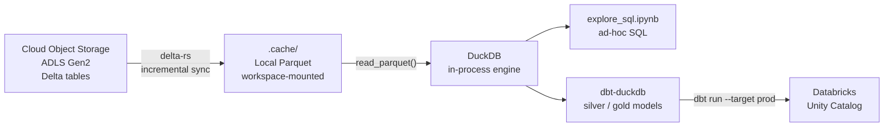

# Local Lakehouse DevEx

A self-contained devcontainer for iterating on Delta Lake tables and dbt models locally, without needing a running Databricks cluster.

## Why

Day-to-day tasks like schema inspection, backfill logic, and dbt model development do not need Databricks compute. This environment reads Delta tables directly from Azure ADLS Gen2 using your `az login` session and runs dbt against a local DuckDB file, free and instant. When a model is ready, one flag change pushes it to Databricks.

| Task | Before | After |
|---|---|---|
| Schema inspection, row counts | Databricks cluster (~60s) | Free, local DuckDB (~1s) |
| Ad-hoc SQL exploration | SQL warehouse | Free, local Parquet cache |
| dbt model development | SQL warehouse | Free, local DuckDB (~3s per run) |
| Production run | SQL warehouse | `dbt run --target prod` |

## When this does not fit

This approach is designed for GB-scale tables, not TB-scale production volumes. Before adopting it, check these constraints against your data:

| Constraint | Practical ceiling | Why |
|---|---|---|
| Local disk | ~50-100 GB total cache | Parquet files are downloaded to the devcontainer volume |
| DuckDB memory | ~20-50 GB per query | DuckDB is single-node; large aggregations must fit in RAM |
| Parquet file count | ~10k files per table | Each file adds footer-scan overhead on connection; beyond ~500 files `register_local()` switches to a lazy PyArrow dataset, which helps but has its own overhead |
| Sync time | Tables above ~5 GB take minutes on first sync | Subsequent syncs are incremental so only new files are downloaded, but the first pull of a large table is slow |
| Model SQL parity | Only DuckDB-compatible SQL | Silver/gold models must be expressible in both DuckDB and SparkSQL via the `cross_db` macros; anything that needs Spark-specific features (e.g. complex window functions with Spark-only syntax, ML functions) must stay on the `prod` target |

The sweet spot is a team working with a subset of production tables (a handful of sources, each a few GB) where the development loop matters more than processing the full dataset. If your tables are hundreds of GB each, use the `prod` target directly and treat this tooling only for schema inspection on sampled data.

---

## Architecture



Key properties:

- `delta-rs` reads the Delta log directly: no Spark, no JVM
- `.cache/` is a host-mounted volume so it survives container rebuilds
- Incremental sync: only files added since last sync are downloaded
- DuckDB runs entirely in-process: no server, no port, no config
- The same dbt model SQL runs on both targets; only the staging layer switches

---

## Structure

```
local-devex/
├── .devcontainer/
│   ├── Dockerfile              Azure CLI, Databricks CLI, GitHub CLI, Claude Code, Python packages
│   └── devcontainer.json       12 GB memory limit, env vars, ports 8888 (Jupyter) + 4213 (DuckDB UI)
├── lakekit/
│   ├── lakehouse.py            LakehouseClient + LakehouseDuckDB, TABLES registry, module-level helpers
│   ├── sync.py                 Incremental Parquet cache, file-level diff against Delta log
│   └── dbutils_stub.py         Databricks dbutils stub that resolves secrets from env vars
├── notebooks/
│   ├── explore_sql.ipynb       Sync tables, register in DuckDB, ad-hoc SQL
│   └── explore_dbt.ipynb       Run models, query results, compile SQL, push to prod
├── dbt/
│   ├── profiles.yml            local (DuckDB) and prod (Databricks) targets
│   ├── dbt_project.yml         Project config, materialization defaults, cache_dir var
│   ├── macros/
│   │   └── cross_db.sql        Syntax adapters for DuckDB vs SparkSQL (see below)
│   └── models/
│       ├── sources.yml         Unity Catalog source definitions (prod target only)
│       ├── staging/            Source abstraction, the only layer that knows local vs prod
│       ├── silver/             Transformation models
│       └── gold/               Aggregation / metrics models
└── requirements.txt
```

---

## Getting started

### 1. Open in devcontainer

Open the repo in VS Code and select **Reopen in Container**. First build takes a few minutes.

### 2. Set environment variables

All configuration is provided through `.devcontainer/devcontainer.json` under `containerEnv`. Edit the placeholder values before opening the container; no secrets are ever hardcoded in source files:

```json
"containerEnv": {
  "AZURE_SUBSCRIPTION_ID": "<your-azure-subscription-id>",
  "ADLS_ACCOUNT":          "<your-adls-account>",
  "DATABRICKS_HOST":       "<your-databricks-host>",
  "DATABRICKS_HTTP_PATH":  "<your-sql-warehouse-http-path>",
  "DATABRICKS_CATALOG":    "<your-unity-catalog>",
  "LAKEHOUSE_DB_PATH":     "/workspaces/your-project/local-devex/.cache/lakehouse_dev.duckdb",
  "LAKEHOUSE_CACHE":       "/workspaces/your-project/local-devex/.cache"
}
```

`LAKEHOUSE_DB_PATH` and `LAKEHOUSE_CACHE` are picked up automatically by `lakekit` and `dbt`; you only need to change them if you want a non-default cache location.

Rebuild the container after editing `containerEnv`.

### 3. Authenticate with Azure

```bash
az login
az account set --subscription $AZURE_SUBSCRIPTION_ID
```

### 4. Register your tables

Edit `lakekit/lakehouse.py` and add your Delta table paths to the `TABLES` dict:

```python
TABLES: dict[str, tuple[str, str, str]] = {
    "raw_events":     ("bronze", "events/raw_events/",     ADLS_ACCOUNT),
    "event_tracking": ("bronze", "events/event_tracking/", ADLS_ACCOUNT),
}
```

Format: `"alias": ("container", "path/relative/to/container/", ADLS_ACCOUNT)`

### 5. Sync the local cache

Open `notebooks/explore_sql.ipynb` and run the **Sync cell**. This downloads Parquet files to `.cache/`. Once done, all queries are instant.

```
Syncing raw_events:     v0 -> v42  +128 files  -0 files
Syncing event_tracking: v0 -> v19  +64 files   -0 files
Done. Local cache: ['raw_events', 'event_tracking']
```

The cache lives in `.cache/`, gitignored and persisting across container rebuilds because the workspace is a host-mounted volume.

---

## Querying tables

After syncing, use `conn.sql()` for any SQL against the local Parquet cache:

```python
conn.sql("SELECT status, COUNT(*) FROM raw_events GROUP BY status ORDER BY 2 DESC")

conn.sql("""
    SELECT e.event_id, e.event_timestamp, t.status
    FROM raw_events e
    JOIN event_tracking t ON e.event_id = t.event_id
    WHERE t.status = 'pending'
    LIMIT 50
""")
```

Re-run the Sync cell whenever you need fresh data. It only downloads files added since last sync.

---

## dbt model development

### Targets

| Target | Reads from | Writes to | Cost |
|---|---|---|---|
| `local` | `.cache/*.parquet` via `read_parquet()` | Local `.duckdb` file | Free |
| `prod` | Unity Catalog `bronze` schema | Unity Catalog `silver` schema | Databricks compute |

### Step-by-step workflow

**1. Run all models locally**
```bash
cd /workspaces/your-project/local-devex/dbt
dbt run --target local
# Completes in ~3 seconds
```

**2. Iterate on a single model**
```bash
dbt run --target local --select events_enriched
dbt run --target local --select events_enriched+   # model and everything downstream
```

**3. Query results**
```python
import duckdb
conn = duckdb.connect('/workspaces/your-project/local-devex/.cache/lakehouse_dev.duckdb')
conn.sql("SELECT * FROM silver.events_enriched LIMIT 20").df()
conn.sql("SELECT * FROM gold.daily_metrics LIMIT 20").df()
```

**4. Inspect compiled SQL**
```bash
dbt compile --target local --select events_enriched
cat target/compiled/my_lakehouse/models/silver/events_enriched.sql
```

**5. Push to Databricks when ready**
```bash
export DATABRICKS_TOKEN=$(databricks auth token --host $DATABRICKS_HOST)
dbt run --target prod
```

---

## Cross-database macro strategy

DuckDB (local target) and SparkSQL (Databricks prod target) have diverging syntax for several common operations. Writing engine-specific SQL directly in silver/gold models breaks the local/prod parity guarantee.

The solution is a thin macro layer in `dbt/macros/cross_db.sql`. All silver/gold models call these macros instead of raw SQL functions. The macro resolves to the correct dialect based on `target.name`.

### Available macros

**`json_str(col, path)`**: extract a string from a JSON column

| Target | Rendered SQL |
|---|---|
| `local` (DuckDB) | `json_extract_string(col, 'path')` |
| `prod` (Spark) | `get_json_object(col, 'path')` |

```sql
-- in any silver/gold model:
{{ json_str('payload', '$.user.email') }} as user_email
```

**`count_if(condition)`**: count rows matching a condition

| Target | Rendered SQL |
|---|---|
| `local` (DuckDB) | `count(*) filter (where condition)` |
| `prod` (Spark) | `count(case when condition then 1 end)` |

```sql
{{ count_if("status = 'completed'") }} as completed_count
```

**`avg_if(expr, condition)`**: average restricted to matching rows

| Target | Rendered SQL |
|---|---|
| `local` (DuckDB) | `avg(expr) filter (where condition)` |
| `prod` (Spark) | `avg(case when condition then expr end)` |

```sql
{{ avg_if('duration_seconds', "status = 'completed'") }} as avg_duration
```

### Adding a new macro

When you hit a syntax difference, add a macro to `cross_db.sql` rather than adding `` inline in a model. Keeping all dialect switches in one place makes them easy to audit and extend.

```sql

  
    -- DuckDB syntax
  
    -- SparkSQL syntax
  

```

---

## Adding a new table

1. Add the table to `TABLES` in `lakekit/lakehouse.py`
2. Run `sync_table(...)` in the Sync cell
3. Create a staging model in `dbt/models/staging/stg_<your_table>.sql` following the existing pattern
4. Reference it in silver/gold models with `{{ ref('stg_<your_table>') }}`

---

## Known gotchas

**Tables with large Delta logs**: use `skip_stats=True` when opening via `DeltaTable`. Without it, `delta-rs` reads per-file column stats from the log on every open, which is slow for tables with many VACUUM/OPTIMIZE transactions. `sync_table()` sets this by default.

**Tables with many Parquet files**: `DuckDB read_parquet()` opens every file footer upfront. For caches with more than 500 files, `register_local()` automatically switches to a lazy PyArrow dataset. The devcontainer runs with `--memory=12g` to support this.

**Token expiry during sync**: `sync_table()` fetches a fresh bearer token per table rather than reusing one across all syncs. Azure access tokens expire after ~60 minutes; without this, long multi-table syncs produce 401 errors.

**dbt shell commands in notebooks**: use the absolute path when running `!dbt ...` in a notebook cell. Each `!` runs in a fresh subshell, so relative paths fail:
```bash
!cd /workspaces/your-project/local-devex/dbt && dbt run --target local
```
